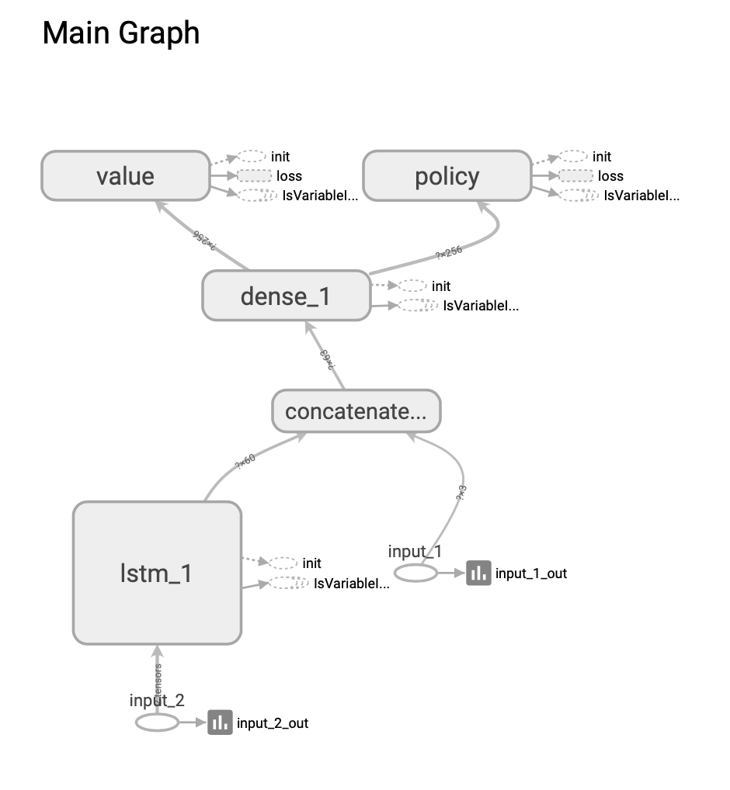
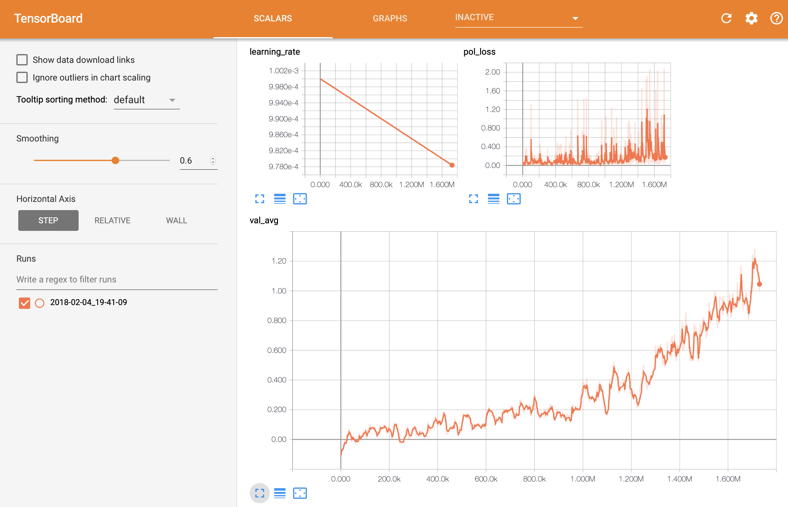

#### Description
This is a toy project to implement A3C reinforcement learning in a stock market environment I stitched together over a weekend in Feb 2018.

The market environment is adapted from [kh-kim](https://github.com/kh-kim/stock_market_reinforcement_learning/blob/master/market_env.py), the A3C is based on [Grezgo's async-rl project](https://github.com/Grzego/async-rl/blob/master/a3c/train.py). The network concatenates an LSTM with a state vector for the portfolio.




#### Usage
Got to Model/A3C/ and open Run.ipynb to start training.

#### Monitor training
Run ```tensorboard --logdir=Model/A3C/Graph/``` to inspect the performance of the model.


